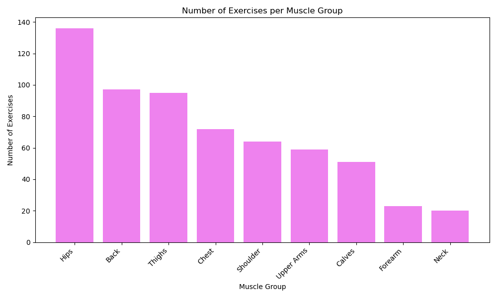
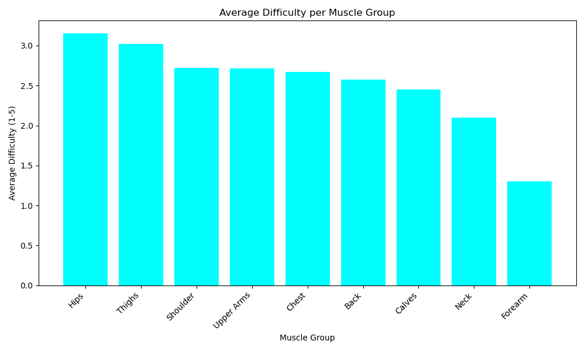
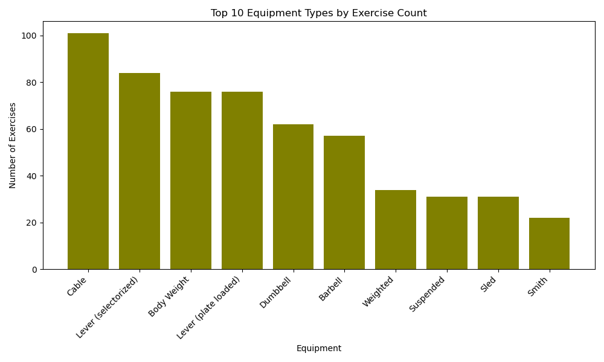
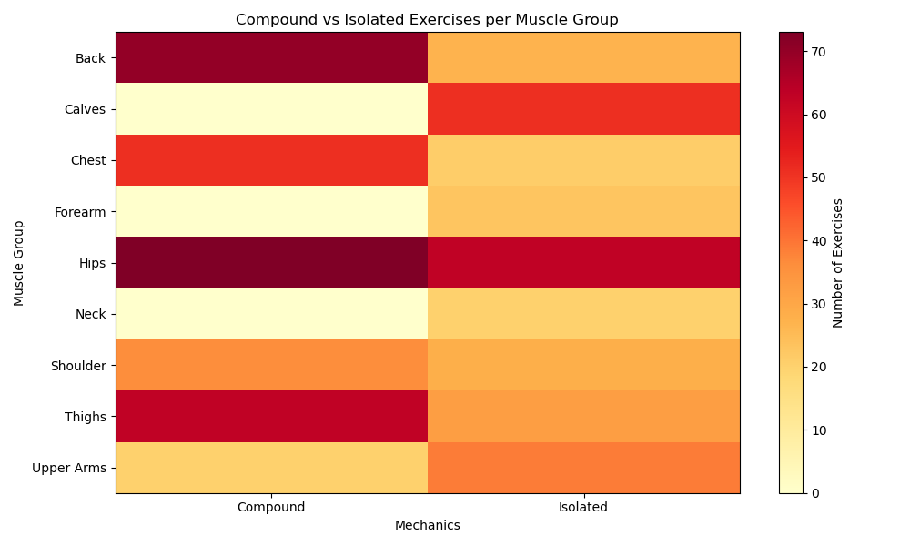

# 💪 Workout Programming Analyzer

## Overview
A data analysis project exploring 617 gym exercises across 9 muscle groups using PostgreSQL and Python.

## Tools Used
- PostgreSQL — data storage and querying
- Python (pandas, matplotlib) — data cleaning and analysis
- SQLAlchemy — database connection

## Dataset
- 617 exercises, 17 columns
- Source: Kaggle
- Covers: muscle groups, equipment, difficulty, mechanics

## Key Findings
- Hips has the most exercises (136), Neck the least (20)
- Hips and Thighs are the hardest muscle groups to train (avg difficulty 3.15 and 3.02)
- Cable machines offer the most exercise variety (101 exercises)
- Push and Pull exercises are almost perfectly balanced (305 and 311 respectively)
- Forearm has no bodyweight exercises

## Visualizations

## How to Run
1. Clone the repo
2. Create a `.env` file with your `DB_PASSWORD`
3. Run `load_data.py` to load data into PostgreSQL
4. Run `analysis.py` to generate all charts